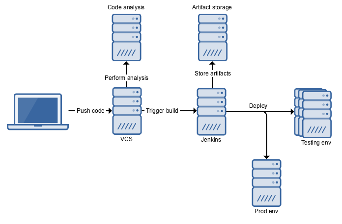
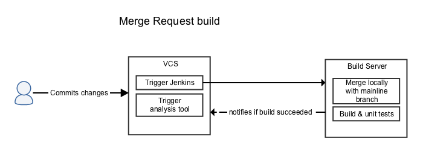
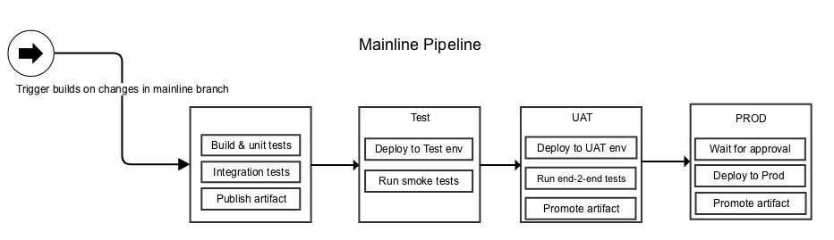

# OSRM Pipeline

## Tasks

> Write a Dockerfile to run a container that serves the OSRM backend

> Write a Jenkins pipeline script for CD of an OSRM backend

### Assumptions

* Backend application:
    * requires pre-processed data which is obtained from remote storage and processed locally
    * is stateless and doesn't require any persistence
* Backend application orchestration should be identical on any environment
* Application stack consists of backend and frontend, although task didn't specify frontend I've included it
* Changes to mainline branch is done via merge requests(MR)
* In case of failure, we use roll-forward strategy
 

### Out of scope
* Current setup is not sufficient for running prod and to make it prod ready:
    * Logging
    * Monitoring/health-check
    * Healing
    * Scalability
    * Metrics
* Provisioning Underlying infrastructure
* Proper deployment via orchestration tools
* Image versioning/tagging

## Build/Deployment system architecture

> High level design with all important system components.

| Type  | description |
|---|---|
| ***Build Server*** | for building and deploying application |
| ***VCS*** | for storing and managing source code |
| ***Artifact Storage*** | for maintain and store build artifact |
| ***Code Analysis tool*** | to provide reports code quality reports during MR |
| ***Testing env*** | to run application during development process |
| ***Prod env*** | to run application on production env | 

*Note: Described setup is nowhere near complete in modern IT environment, but as provided application in task don't use any of other tools, I've excluded them from diagrams.*

## Pipeline

> Describes detailed pipeline setup.

### Changes to mainline branch pipeline

All changes is done via MR, once MR is created: 
1. Build server pull new branch and merges it locally with latest
2. Build and runs tests
3. Runs statistical code analysis on new changes
4. Post build and analysis results back to MR, depending on results MR can be merged on rejected

*Note: Described setup is one way to do it, some organization prefer to use fork as version control strategy*.

### Mainline branch pipeline

After changes are merged into mainline branch:
1. Build server triggers pipeline build
2. Runs build and unit tests
3. Runs integration tests
4. Publish to artifact storage
5. Deploy to Test environment
6. Run smoke tests
7. Deploys to UAT environment
8. Runs end to end tests
9. Tags artifacts that it's production ready
10. Waits for approval for deployment
11. Deploys to Prod server
12. Tags artifacts it's deployed to production

*Note: Task required continuous delivery, which is why I've added wait step.*

## Jenkins pipeline file

* Although task specified ideal CD pipeline, due to task scope this not possible 
    * Deployment is done in "very basic" way, this is no way how to do proper container deployment
    * Most code is mocked as there are not unit/integration/smoke testes
    * Code doesn't produce any reports
    * Images should be tagged with proper version
    * Most of code could be moved to shared pipeline library, which would allow this to be used/reused/templated

